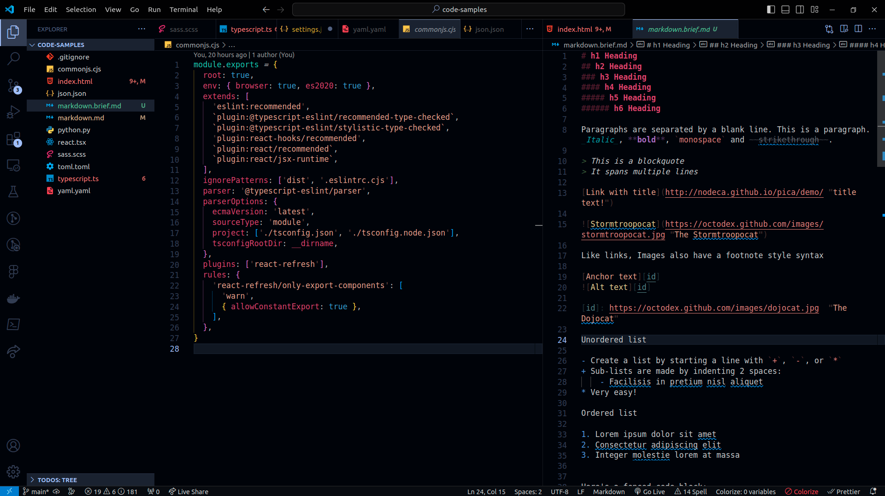
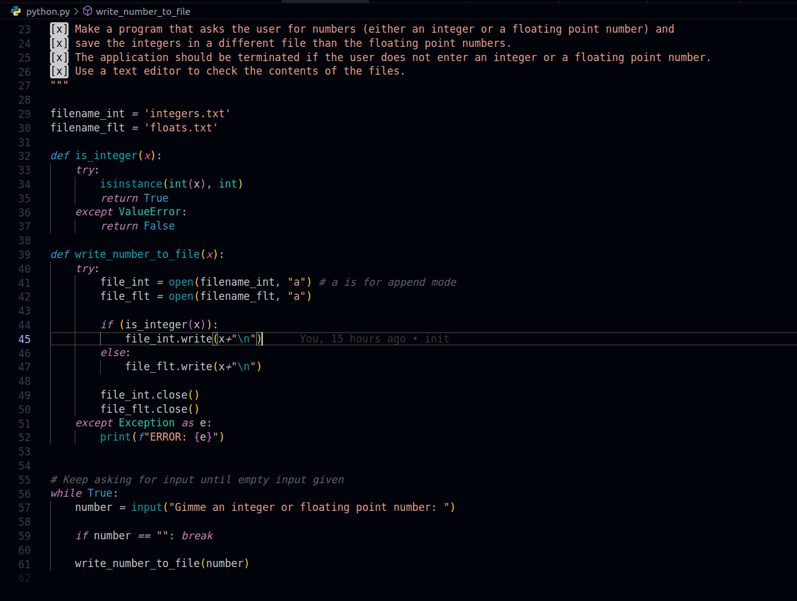
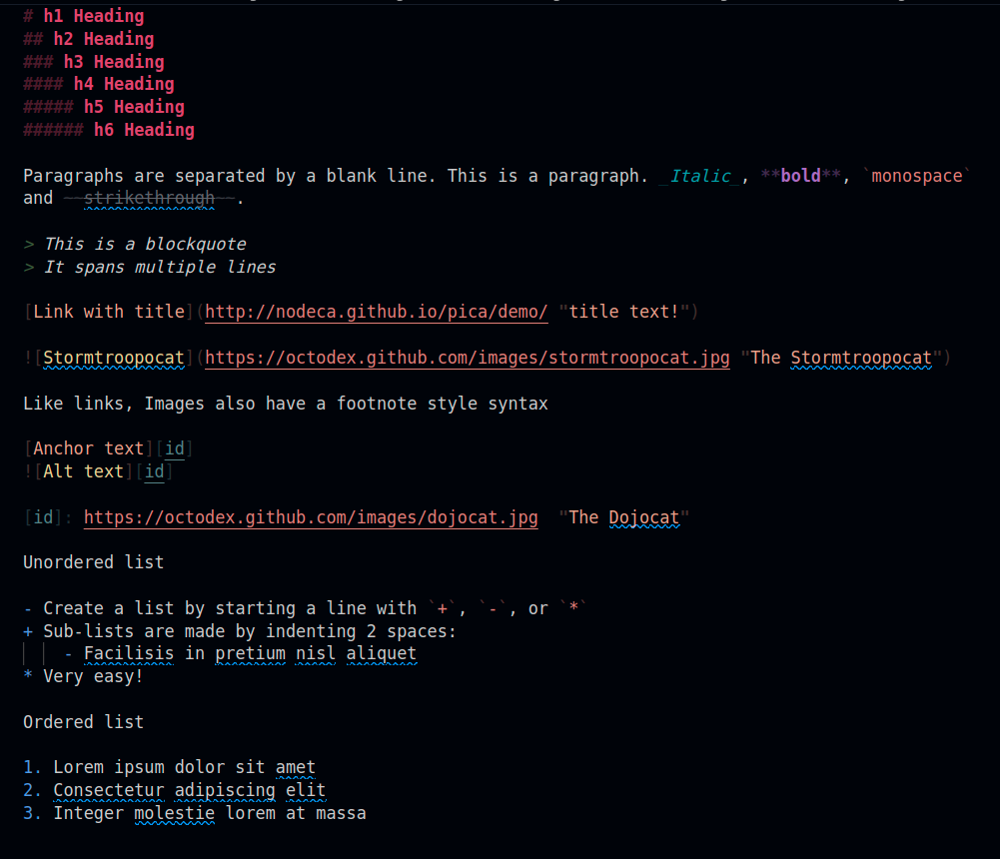
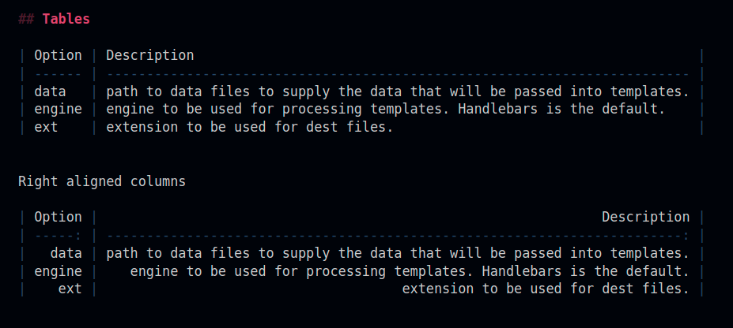
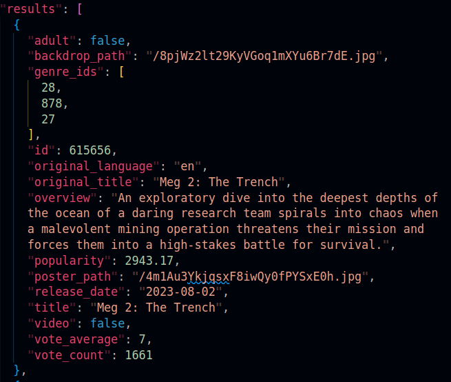
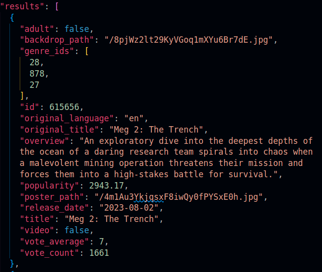

# Lasik - Super Dark
A dark, easy on the eyes theme for Visual Studio Code that has decent contrast for coders with sensitive eyes.

The theme was developed for personal use by a developer who writes a lot of React, TypeScript, Python, Sass/CSS, HTML and Markdown files.

**Installation**

Launch VS Code Quick Open (`Ctrl+P`), paste the following command, and press enter.

```
ext install AmnaAkram.lasik
```



## Python



## Markdown





## Dimmed punctuation

Some elements have been dimmed (for example quotes around strings and property names in JSON and HTML, or punctuation around Markdown elements), to give more emphasis to the actual _keys_ and _values_ and not punctuation marks. The assumption here is that you already have a linter or syntax highlighting good enough to point out a missing punctuation and you don't necessarily need to see them prominently.

This is more readable:



than this:

